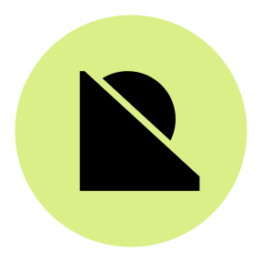
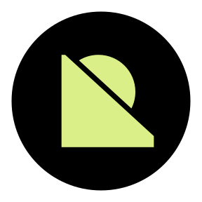
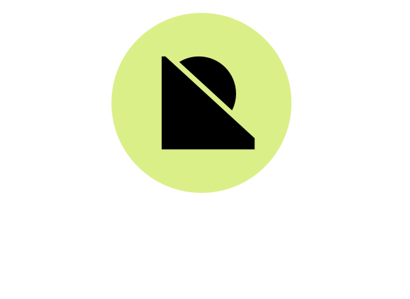
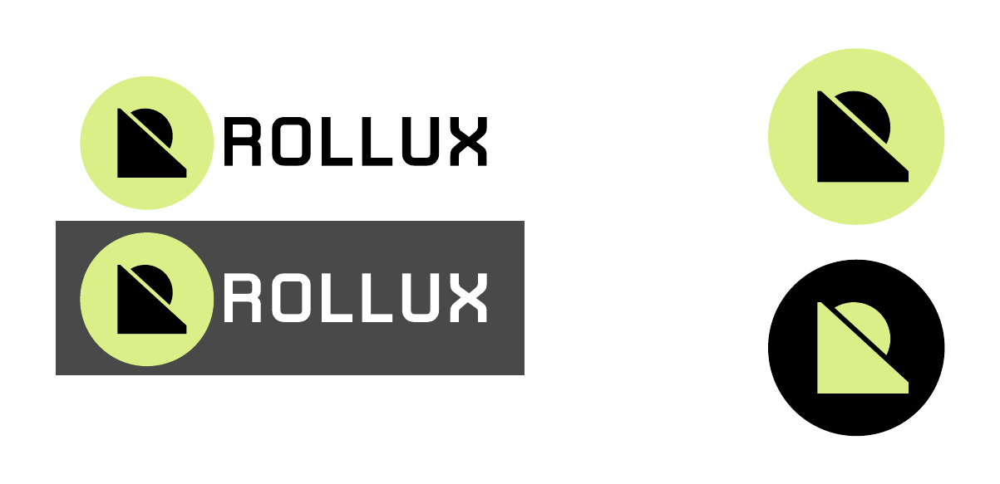
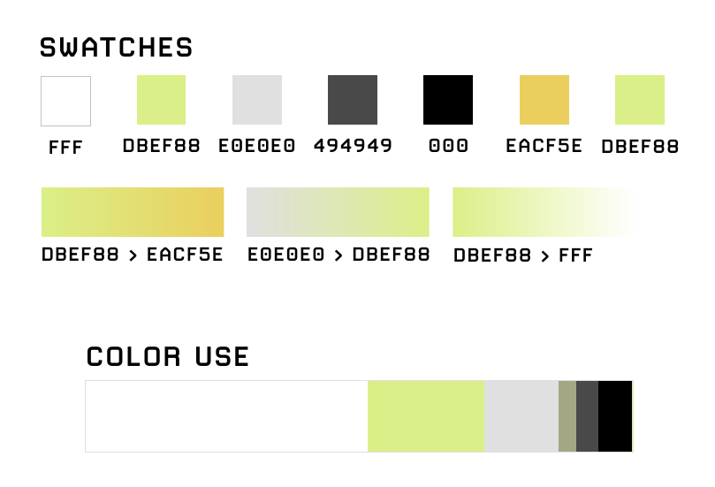

  

# Visual identity guide for **Rollux**.
Here are the Rollux branding tools you'll need to build and promote your project.

# 

## General guidelines

To maintain a level of consistency for all Rollux core brand assets, please keep it simple.  No drop shadows, rotations, manipulations, or effects.

Use rolluxGreen (#DBEF88) or Inverted logo, and/or black wordmark (#000) to ensure visual contrasts on a light background. On a dark background, use either the rolluxGreen logomark alone, or the rolluxGreen logo with the wordmark in white (#FFF).

Although the wordmark logo is all-caps, the proper use of the name within a body of typed text is "Rollux". 

#

## Logos for web or other digital use

|  Logo             |   Logo w/ Wordmark, Horizontal                                           |  Logo w/ Wordmark, Vertical
| ----------------- | ------------------------------------------------------------------ | -----------------------------------------------------------------
|    |  | 
|    |  | 

#

## Logos for printed materials

You should use CMYK color mode on printed materials for a proper final product. CMYK versions are available in each directory for each logo format, e.g. [SVG/rollux_logo_cmyk.svg](SVG/rollux_logo_cmyk.svg)  

#

## Usage examples

Refer to this illustration for proper use of logo relative to backgrounds.

  

## Color Palette

If you wish to align surrounding material or content with the Rollux branding, you can obtain color samples and usage ratios from these swatches.

  

#

## Community links

